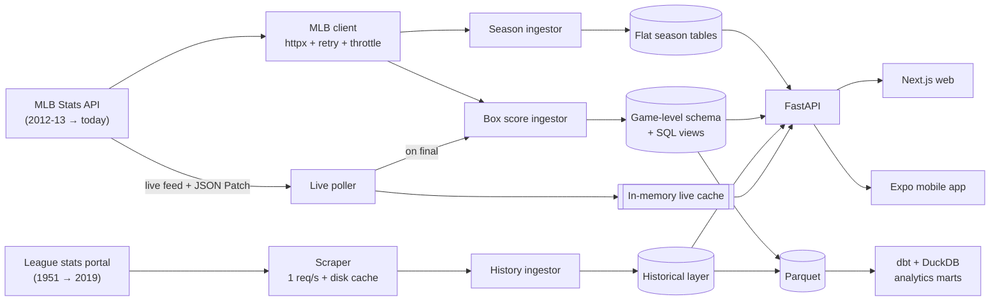
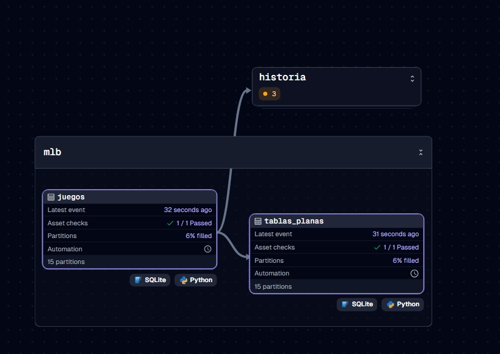
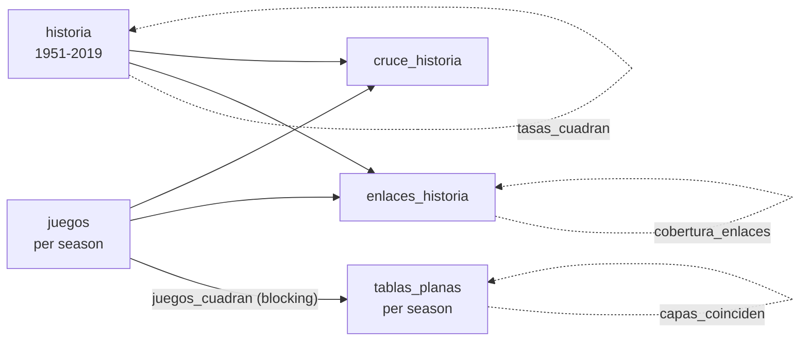
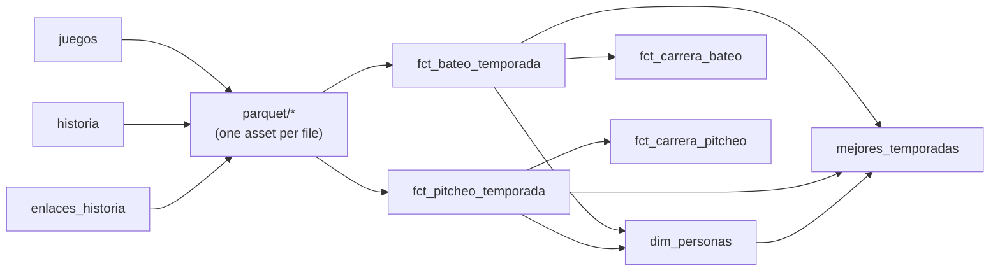

# Deportiv

[](https://github.com/arturomespinal/lidom-stats/actions/workflows/verify.yml)

**Stats, live scores and history for LIDOM, the Dominican Professional Baseball League.**

Deportiv is a data platform for Dominican winter baseball. It covers:

- every game from 2012-13 to today, with box scores, player and team pages, and leaderboards;
- a live game engine that follows each game pitch by pitch;
- a win-probability model calibrated on LIDOM's own run environment;
- the league's history back to 1951.

The project has three parts:

- a Python data pipeline, orchestrated with Dagster, with a dbt analytics layer and a REST API;
- a Next.js web app;
- an Expo / React Native mobile app.

> Status: in active development, aiming to launch for the 2026-27 season (mid-October 2026).
> Most code comments and the internal docs ([`CLAUDE.md`](CLAUDE.md), [`deploy/oracle/GUIA.md`](deploy/oracle/GUIA.md)) are in Spanish.

---

## What it does

- **Today.** The day's games, the featured game and its headline, the standout performers of the night, and a calendar to jump to any date.
- **Live games.** Score, count, base runners, play-by-play, inning grid, box score and lineups. They update every ~10 seconds from the official feed, with a win-probability chart drawn as the game unfolds.
- **Player pages.** Season-by-season stats across both data sources, recomputed career totals, league rank among qualified players, and a career curve against the league average.
- **Team pages.** The pennant race game by game, last ten games, standing relative to the playoff line, roster leaders and full roster.
- **History.** All-time leaders since 1951, and pages for players who retired before 2012, including Juan Marichal, Rico Carty and the Alou brothers.
- **Standings and leaderboards** for 14 seasons, with qualification minimums adapted to a short winter league.

## Architecture



**Two storage layers fed by the same API through independent paths.** The flat tables store the season aggregates the API publishes. The game-level schema stores atomic counts from every box score; rates such as AVG, ERA and WHIP come only from SQL views. Because the paths are independent, they validate each other. Across all 14 seasons, 8 match to the digit and the other 6 differ for documented, test-pinned reasons: forfeits, and discrepancies inside the MLB API itself.

**One source per season.** Before 2012-13 the only source is the league's official stats portal. From 2012-13 on, it's the MLB Stats API. The overlapping years (2012-2019) are used only to link players across sources (1,588 of 1,614 linked, 98.4%) and to cross-check totals. They are never summed twice.

**Orchestration.** [Dagster](orquestacion/) runs the ingestion as software-defined assets partitioned by season. Every load validates itself with asset checks. If a game's lines don't add up to its score, the check blocks the downstream load. If the two layers disagree beyond the known differences, the check fails and shows which team or player. The checks call the same functions as `verify_capas.py` (`src/validacion.py`), so tests and production share one definition of "correct".



*The 2025-26 partition of `juegos` and `tablas_planas`, loaded from the MLB API with both checks passing. The `historia` group is collapsed.*



**Analytics layer.** The database is exported to Parquet and modeled with [dbt on DuckDB](analitica/): season and career facts for every player since 1951, with one source per season, and the **best seasons in league history** per category, ties shared. Business rules stay in Python and are exported as tables, so dbt never re-implements them. This matters: Python's `round()` rounds half to even (3.1 × 15 = 46.5 → 46) while SQL rounds half up (47), so a qualification minimum computed in SQL would disagree with the app. In Dagster, every Parquet file and every dbt model is an asset, and every dbt test is an asset check. A failing test blocks the models downstream of it.



**The live engine** polls the official feed. After the first full download it applies only JSON Patch diffs, which measured **10.5× less traffic** than refetching. It keeps state in memory, not in the database. When a game ends, it ingests that game's box score and refreshes the season tables.

## Engineering highlights

- **A win-probability model built for this league.** It is a Markov chain over the 24 base-out states, with transition rates taken from 45,000+ LIDOM batting lines. A Major League table would understate leads here: LIDOM scores 4.12 runs per team per game, and home runs come in 1.36% of plate appearances, against ~3% in MLB. Only the mean was fitted. The model reproduces the **entire** runs-per-game distribution within 5 points of error out of 200, and home teams win 54.6% in the model against 54.3% in reality.
- **Rates are recomposed, never averaged.** Career and multi-team AVG, OBP and ERA are rebuilt from summed counts on the server, so web and mobile can never disagree.
- **Defensive scraping.** Columns are mapped by header, never by position. Every scraped row is checked against the rates the source page publishes itself, so a shifted column fails loudly instead of corrupting data. Known errors in the source are listed one by one, page by page.
- **Production hardening.** Per-IP rate limiting, which accounts for mobile carrier CGNAT. Configuration-driven CORS that is never `*`. Diagnostics behind a key, with constant-time comparison. A server key for the web's server-side rendering. The API refuses to start with an insecure configuration.
- **Data quality as code, run in two places.** The cross-layer validation is one module, used by the test suite and by the Dagster asset checks after every load. A blocking check stops a bad load from spreading downstream. The suite proves it by corrupting a synthetic database on purpose and checking that the right check fails.
- **Two implementations, one answer.** The dbt career totals are compared, person by person, against the Python code the API serves: 996 batters and 1,300 pitchers, identical counts and rates. Corrupted Parquet files must fail the specific dbt test that guards against that corruption.
- **Idempotent ingestion everywhere.** Re-running any ingest never duplicates data, and edge cases such as postponed-game collisions, extra innings and forfeits are handled deterministically.

## Tech stack

| Layer | Tools |
|-------|-------|
| Pipeline and API | Python 3.11+, FastAPI, SQLAlchemy 2, Pydantic 2, httpx, tenacity, BeautifulSoup, jsonpatch, SQLite |
| Orchestration | Dagster 1.13 (partitioned assets, blocking asset checks, schedules), dagster-dbt |
| Analytics | dbt Core 1.12, DuckDB 1.5, Parquet (pyarrow) |
| Web | Next.js 16 (App Router, Turbopack), React 19, TypeScript, Tailwind CSS |
| Mobile | Expo SDK 57, React Native 0.86, React Navigation 7, react-native-svg |
| Deployment and CI | Oracle Cloud (Ampere A1), systemd, Caddy (automatic HTTPS), Vercel, GitHub Actions |

## Data coverage

| | |
|---|---|
| Game-level seasons | 14 (2012-13 → 2025-26) |
| Games | 2,014 |
| Players | 2,253 |
| Batting / pitching lines | 45,029 / 24,729 |
| Historical seasons | 1951 → 2019-20 (regular season and playoffs) |

## Getting started

### Requirements

- Python 3.11 or newer
- Node.js 20 or newer (web and mobile)
- For the mobile app: Expo Go on a phone, signed into the same Expo account as the CLI (`npx expo login`)

### 1. API

```bash
pip install -r requirements.txt

# The database is not versioned. Build it (needs network):
python main.py ingest-games 2025     # game-level schema for 2025-26
python main.py ingest 2025           # flat season tables for 2025-26
# Repeat for 2012…2024 for full coverage, then optionally:
python main.py ingest-historia       # league history 1951-2019 (~1 hour at 1 req/s)

uvicorn api.main:app --reload        # http://localhost:8000/docs
```

Note on seasons: the MLB API labels a winter season by the year it **starts**, so `2025` is the 2025-26 season. The API accepts both `2025` and `2025-26`.

### 2. Orchestration (optional)

```bash
pip install -r requirements-orquestacion.txt
dagster dev -m orquestacion          # http://localhost:3000, from the repository root
```

On Windows with the Microsoft Store Python, the `dagster` command is not on the PATH. Use `python -m dagster dev -m orquestacion` instead.

The UI shows the asset graph, one partition per season, the history of every load and its checks. To keep that history between sessions, point `DAGSTER_HOME` at a folder first. The `cada_madrugada` schedule refreshes the current season every morning during the season; it ships turned off.

### 3. Analytics layer (optional)

```bash
pip install -r requirements-analitica.txt
python main.py exportar-parquet      # data/parquet/<table>.parquet
cd analitica
dbt build                            # models and tests → data/analitica.duckdb
```

With the Microsoft Store Python, use `python -m dbt.cli.main build` if `dbt` is not on the PATH. With Dagster installed, the `capa_analitica` job does both steps; its `cada_manana` schedule runs after the morning load and ships turned off.

### 4. Web

```bash
cd frontend
npm install
npm run dev                          # http://localhost:3000
```

It points at `http://localhost:8000` by default. Set `NEXT_PUBLIC_API_URL` in `frontend/.env.local` to use another API.

### 5. Mobile

```bash
cd mobile
npm install
npx expo start
```

In Expo Go, the app finds the API on your computer by itself, using the address Expo Go is already connected to. Run the API with `--host 0.0.0.0` so the phone can reach it, or set `EXPO_PUBLIC_API_URL` in `mobile/.env` to use a deployed API.

### Live games off-season, without network

```bash
python dev_live_offline.py                    # replays a captured game into the live cache
python dev_live_offline.py 826343 --hasta 5   # stops mid-game, so it shows as LIVE
```

## Tests

There are thirteen verification suites. They need no network: they run against captured feeds, a simulated MLB client, saved source pages, a synthetic database or the local database. Each one exits with code 0 only if every check passes.

```bash
python verify_game_routes.py && python verify_live_detail.py && python verify_live_parser.py \
  && python verify_live_poller.py && python verify_boxscore_ingestor.py && python verify_api_models.py \
  && python verify_winprob.py && python verify_capas.py && python verify_seguridad.py \
  && python verify_digimetrics.py && python verify_historia.py
python verify_orquestacion.py        # needs requirements-orquestacion.txt
python verify_analitica.py           # same
```

**Continuous integration** ([`.github/workflows/verify.yml`](.github/workflows/verify.yml)): every push and pull request runs four jobs in parallel.

- The eight suites that need no database. The live-engine suites replay real snapshots of a game, downloaded once from the MLB API and cached.
- The Dagster definitions, their suite and the analytics suite (Parquet export, `dbt build`, dbt tests as Dagster checks).
- Type check, lint and production build of the web app.
- Type check of the mobile app.

The other three suites check the real database, which is not versioned, and run locally before each change ships.

`verify_capas.py` cross-validates the two storage layers season by season. `verify_orquestacion.py` runs the assets against a synthetic database, corrupts it on purpose, and checks that the right asset check fails and that the blocking one stops the downstream load. `verify_analitica.py` builds a synthetic database with both sources, runs dbt on it, compares every career with the API's own computation, and damages the Parquet on purpose to check that the right dbt test fails. `verify_seguridad.py` boots the API in production mode and checks the rate limit, CORS and diagnostics. `verify_winprob.py` fails if anyone changes a transition probability.

## Deployment

[`deploy/oracle/`](deploy/oracle/) contains everything needed to run the API, database and live engine on an Oracle Cloud Always Free instance:

- a one-shot installer;
- systemd units: single worker, bound to localhost, read-only filesystem except `data/`;
- a Caddy config for automatic HTTPS;
- daily SQLite backups with integrity checks;
- update and maintenance scripts.

The web app deploys to Vercel. The step-by-step guide is in [`deploy/oracle/GUIA.md`](deploy/oracle/GUIA.md) (in Spanish).

## Project layout

```
api/            FastAPI app: routes, live endpoints, security middleware
src/
  clients/      MLB Stats API and league-portal HTTP clients
  scrapers/     League-portal table parser
  pipeline/     Season, box-score and history ingestors; cross-source checks
  validacion.py Cross-layer validation, shared by the tests and the asset checks
  exportar.py   Database → Parquet, with the Python business rules exported as tables
  live/         Live feed parser, poller, in-memory cache, replay
  models/       SQLAlchemy models and SQL views
  *.py          Domain logic: career totals, win probability, daily slate,
                pennant race, qualification minimums, name display
orquestacion/   Dagster assets, checks, jobs and schedules (ingestion and analytics)
analitica/      dbt project on DuckDB: season and career facts, best seasons ever
frontend/       Next.js web app
mobile/         Expo / React Native app
deploy/oracle/  Production deployment (installer, systemd, Caddy, backups)
verify_*.py     Verification suites
main.py         Pipeline CLI (ingest, ingest-games, ingest-game, ingest-historia, exportar-parquet, …)
```

## Data sources and disclaimer

Deportiv is an independent project. It is **not affiliated with, endorsed by, or sponsored by** LIDOM, its six clubs, or Major League Baseball.

- Current-era data comes from the public MLB Stats API (`statsapi.mlb.com`). Its responses carry MLB Advanced Media's copyright notice, which allows individual, non-commercial, non-bulk use.
- Historical data comes from the league's public statistics portal. It is collected at one request per second with a local cache, and player photos served by the portal are never stored.
- Team names belong to their owners. The repository includes no logos or crests; teams are shown by their three-letter code on their club color.
